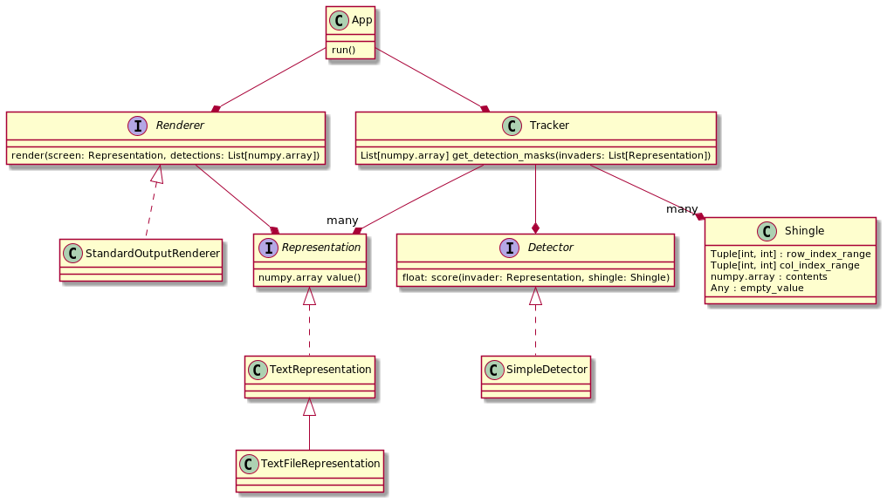

Alien Tracker
=============

Overview
--------

This is a simple command-line app that finds text (ASCII art) patterns in a text (ASCII art) file.

The purpose of this project is to be an exercise in the use of S.O.L.I.D. principles.

The app's class diagram follows below:

Project Dependencies
--------------------

Interpreter
~~~~~~~~~~~

We are using Python 3.8.3. We recommend to create your own virtual environment for this project as following:

.. code-block:: bash

     $ cd <your project root>
     $ python3.8 -m venv .venv
     $ source .venv/bin/activate

Package Manager
~~~~~~~~~~~~~~~

We are using `poetry <https://python-poetry.org>`_. You may install poetry by executing the following command:

.. code-block:: bash

    curl -sSL https://raw.githubusercontent.com/python-poetry/poetry/master/install-poetry.py | python -

Once poetry is installed, you may install all the project's dependencies as following:

.. code-block:: bash

    poetry install

This should install all the dependencies listed in `pyproject.toml`. Specific versions are listed in `poetry.lock`.

Installing the App
------------------

.. code-block:: bash

    $ cd <your project root>
    $ python setup.py install

Now you should be able to call the app from anywhere:

.. code-block:: bash

    $ alien-tracker --help

Running the App
---------------

You may follow the instructions from the previous section to install the app or run it in development mode:

.. code-block:: bash

    $ python -m alien_tracker --help
    Usage: python -m alien_tracker [OPTIONS]

    Options:
      -s, --screen TEXT      Path to a text file with the screen  [required]
      -t, --threshold FLOAT  Detection threshold in the interval (0.0, 1.0)
                             [required]
      -i, --invaders TEXT    Path to a text file with an invader. Multiple
                             invaders might be provided  [required]
      --help                 Show this message and exit.

Examples of calling the app:

.. code-block:: bash

    $ python -m alien_tracker.cli -s ./tests/resources/screens/sample-screen.txt -t 0.75 -i ./tests/resources/invaders/squid.txt
    $ python -m alien_tracker.cli -s ./tests/resources/screens/sample-screen.txt -t 0.75 -i ./tests/resources/invaders/crab.txt
    $ python -m alien_tracker.cli -s ./tests/resources/screens/sample-screen.txt -t 0.75 -i ./tests/resources/invaders/squid.txt -i ./tests/resources/invaders/crab.txt
    $ python -m alien_tracker.cli -s ./tests/resources/screens/sample-screen.txt -t 0.8 -i ./tests/resources/invaders/squid.txt -i ./tests/resources/invaders/crab.txt

Running Tests
-------------

.. code-block:: bash

    $ pytest -s -vvv

You should get an output similar to this:

.. code-block:: text

    collected 14 items

    tests/test_cli.py::TestCLI::test_track_multiple_invaders PASSED
    tests/test_cli.py::TestCLI::test_track_single_invader PASSED
    tests/test_decoders.py::TestDecoders::test_decode_text_file_invader PASSED
    tests/test_detectors.py::TestDetectors::test_simple_detector_detected PASSED
    tests/test_detectors.py::TestDetectors::test_simple_detector_detected_with_noise PASSED
    tests/test_detectors.py::TestDetectors::test_simple_detector_undetected PASSED
    tests/test_renderers.py::TestRenderers::test_standard_output_renderer PASSED
    tests/test_scanner.py::TestScanner::test_extract_shingles PASSED
    tests/test_shingle.py::TestShingle::test_create_first_inside_screen_shingle PASSED
    tests/test_shingle.py::TestShingle::test_create_first_outside_screen_shingle PASSED
    tests/test_shingle.py::TestShingle::test_create_next_inside_screen_shingle_down PASSED
    tests/test_shingle.py::TestShingle::test_create_next_inside_screen_shingle_to_the_left PASSED
    tests/test_shingle.py::TestShingle::test_create_next_outside_screen_shingle_down PASSED
    tests/test_shingle.py::TestShingle::test_create_next_outside_screen_shingle_to_the_left PASSED

    ========================================== 14 passed in 0.31s ==========================================

Coverage Reports
----------------

.. code-block:: bash

    $ coverage run --source=alien_tracker -m pytest
    $ coverage report

You should get an output similar to this:

.. code-block:: bash

    Name                         Stmts   Miss  Cover
    ------------------------------------------------
    alien_tracker/__init__.py        2      0   100%
    alien_tracker/app.py            15      0   100%
    alien_tracker/cli.py             9      0   100%
    alien_tracker/decoders.py       17      0   100%
    alien_tracker/detectors.py      12      0   100%
    alien_tracker/renderers.py      32      0   100%
    alien_tracker/shingle.py        21      0   100%
    alien_tracker/tracker.py        32      0   100%
    ------------------------------------------------
    TOTAL                          140      0   100%

For a more detailed view of the coverage run the following command for HTML reports:

.. code-block:: bash

    $ coverage html

Reports will be made available in the folder `htmlcov`.

Developer's Hints
-----------------

O.S. Dependencies
~~~~~~~~~~~~~~~~~

You may need to install `libffi-dev`:

.. code-block:: bash

    sudo apt-get install libffi-dev
